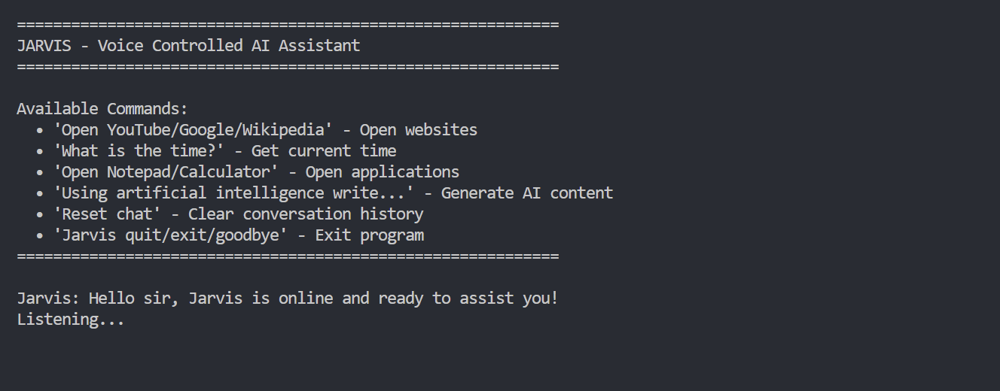

# 🤖 JARVIS - Voice-Controlled AI Assistant

<div align="center">


**A sophisticated voice-controlled AI assistant powered by Google's Gemini AI**

</div>

---

## 📋 Table of Contents

- [About](#-about-the-project)
- [Features](#-features)
- [Technology Stack](#-technology-stack)
- [Prerequisites](#-prerequisites)
- [Installation](#-installation)
- [Usage](#-usage)
- [Command Reference](#-command-reference)
- [Project Structure](#-project-structure)
- [How It Works](#-how-it-works)
- [Future Enhancements](#-future-enhancements)
- [Contributing](#-contributing)
- [License](#-license)
- [Contact](#-contact)

---

## 🌟 About The Project

JARVIS (Just A Rather Very Intelligent System) is a voice-controlled AI assistant inspired by the AI from Iron Man. This project demonstrates the integration of multiple AI technologies including:

- **Speech Recognition** for voice command input
- **Natural Language Processing** using Google's Gemini AI
- **Text-to-Speech** for audio responses
- **Task Automation** for system and web operations

### Why JARVIS?

In today's fast-paced world, hands-free interaction with computers is becoming increasingly important. JARVIS provides:

- ✅ **Hands-free Operation**: Control your computer with voice commands
- ✅ **AI-Powered Intelligence**: Context-aware conversations using Gemini AI
- ✅ **Task Automation**: Quick access to websites, apps, and information
- ✅ **Content Generation**: Create documents, code, and creative content with AI
- ✅ **Learning Platform**: Great project for understanding AI integration

---

## ✨ Features

### 🎤 Voice Interaction

- Real-time speech recognition with ambient noise adjustment
- Natural language processing for command interpretation
- High-quality text-to-speech responses

### 🤖 AI Capabilities

- Powered by Google's Gemini 2.0 Flash model
- Context-aware conversations with memory
- Intelligent content generation (essays, emails, code, stories)
- Smart differentiation between short Q&A and long-form content

### 🚀 Automation

- **Web Automation**: Open YouTube, Google, Wikipedia, GitHub, StackOverflow
- **System Control**: Launch Notepad, Calculator, Paint, File Explorer
- **Time Queries**: Get current system time via voice
- **Chat History**: Automatic conversation logging with timestamps

### 💾 File Management

- Automatic chat history saving
- Generated content saved to organized files
- Timestamped file naming for easy retrieval

---

## 🎬 Demo

### Screenshots

**Main Interface**


**Conversation Example**

```
You said: open youtube
Jarvis: Opening youtube, sir...

Listening...
You said: what is the time
Jarvis: Sir, the time is 03 45 PM

Listening...
You said: using artificial intelligence write a short poem about technology
Jarvis: Content generated and saved successfully sir.
```

---

## 🛠️ Technology Stack

| Technology                                                                                      | Purpose                                  |
| ----------------------------------------------------------------------------------------------- | ---------------------------------------- |
|     | Core programming language                |
|  | AI model for natural language processing |
| **speech_recognition**                                                                          | Convert speech to text                   |
| **pyttsx3**                                                                                     | Text-to-speech engine                    |
| **OpenAI API Client**                                                                           | Interface with Gemini AI                 |
| **webbrowser**                                                                                  | Web automation                           |
| **os**                                                                                          | System operations                        |

---

## 📦 Prerequisites

Before you begin, ensure you have the following installed:

- **Python 3.8 or higher**
- **Microphone** (for voice input)
- **Speakers/Headphones** (for audio output)
- **Internet Connection** (for AI and speech recognition)
- **Google Gemini API Key** (for Gemini API Key)

---

## 🚀 Installation

### Step 1: Clone the Repository

```bash
# Clone the repository
git clone https://github.com/Amarsah15/jarvis-ai-assistant.git

# Navigate to project directory
cd jarvis-ai-assistant
```

### Step 2: Install Dependencies

```bash
pip install -r requirements.txt
```

---

## ⚙️ Configuration

### 1. Get Gemini API Key

1. Visit Google AI Studio
2. Sign in with your Google account
3. Click "Create API Key"
4. Copy your API key

### 2. Create Configuration File

Create a file named `config.py` in the project root:

```python
# config.py
apikey = "YOUR_GEMINI_API_KEY_HERE"
```

### 3. Verify Installation

```bash
python main.py
```

If everything is set up correctly, you should hear:

> "Hello sir, Jarvis is online and ready to assist you!"

---

## 💻 Usage

### Starting JARVIS

```bash
# Make sure you're in the project directory
python main.py
```

### Basic Commands

#### Opening Websites

```
"Open YouTube"
"Open Google"
"Open Wikipedia"
"Open GitHub"
"Open Stack Overflow"
```

#### System Operations

```
"What is the time?"
"Open Notepad"
"Open Calculator"
"Open Paint"
"Open File Explorer"
```

#### AI Features

```
"Using artificial intelligence write a poem about nature"
"Using artificial intelligence create an email for job application"
"Using artificial intelligence explain quantum computing"
```

#### Chat Features

```
"What is the capital of France?"
"Tell me a joke"
"How does photosynthesis work?"
"Reset chat" (clears conversation history)
```

#### Exit Commands

```
"Jarvis quit"
"Exit"
"Goodbye"
"Bye Jarvis"
```

---

## 📖 Command Reference

### Complete Command List

| Category       | Command                                  | Action                    |
| -------------- | ---------------------------------------- | ------------------------- |
| **Web**        | "Open YouTube"                           | Opens YouTube in browser  |
|                | "Open Google"                            | Opens Google Search       |
|                | "Open Wikipedia"                         | Opens Wikipedia           |
|                | "Open GitHub"                            | Opens GitHub              |
|                | "Open Stack Overflow"                    | Opens StackOverflow       |
| **Time**       | "What is the time?"                      | Speaks current time       |
|                | "Tell me the time"                       | Speaks current time       |
| **Apps**       | "Open Notepad"                           | Launches Notepad          |
|                | "Open Calculator"                        | Launches Calculator       |
|                | "Open Paint"                             | Launches Paint            |
|                | "Open File Explorer"                     | Opens File Explorer       |
| **AI Content** | "Using artificial intelligence write..." | Generates content with AI |
|                | "Generate using AI..."                   | Generates content with AI |
| **Chat**       | Any question                             | Chats with Gemini AI      |
| **Utility**    | "Reset chat"                             | Clears chat history       |
|                | "Help"                                   | Shows available commands  |
| **Exit**       | "Jarvis quit"                            | Exits the program         |

---

## 📂 Project Structure

```
jarvis-ai-assistant/
│
├── main.py               # Main application file
├── config.py             # API configuration (create this)
├── requirements.txt      # Python dependencies
├── README.md             # Project documentation
├── .gitignore            # Git ignore file
│
├── ChatHistory/          # Saved conversation logs (auto-created)
│   ├── chat_20240115_143022.txt
│   └── chat_20240115_150845.txt
│
├── GeminiOutput/         # AI-generated content (auto-created)
│   ├── write_poem_1234.txt
│   └── explain_quantum_5678.txt
│
└── screenshots/          # Demo images


```

---

## 🔧 How It Works

### Architecture Overview

```
┌─────────────┐      ┌──────────────┐      ┌─────────────┐
│   User      │ Voice│   Speech     │ Text │   JARVIS    │
│  (Speech)   │─────▶│  Recognition │─────▶│   Core      │
└─────────────┘      └──────────────┘      └─────────────┘
                                                   │
                     ┌─────────────────────────────┤
                     │                             │
                     ▼                             ▼
            ┌─────────────────┐         ┌──────────────────┐
            │  Command Parser │         │   Gemini AI API  │
            │  (Keywords)     │         │  (Conversation)  │
            └─────────────────┘         └──────────────────┘
                     │                             │
                     ▼                             ▼
            ┌─────────────────┐         ┌──────────────────┐
            │  Task Executor  │         │   Response Gen   │
            │  (Automation)   │         │   (AI Content)   │
            └─────────────────┘         └──────────────────┘
                     │                             │
                     └─────────────┬───────────────┘
                                   ▼
                          ┌─────────────────┐
                          │  Text-to-Speech │
                          │    (pyttsx3)    │
                          └─────────────────┘
                                   │ Audio
                                   ▼
                          ┌─────────────────┐
                          │      User       │
                          │   (Response)    │
                          └─────────────────┘
```

### Flow Explanation

1. **Voice Input**: User speaks command → Microphone captures audio
2. **Speech Recognition**: Google Speech API converts audio to text
3. **Command Processing**: JARVIS analyzes text for keywords
4. **Execution Branch**:
   - **Simple Commands**: Direct execution (open website, tell time)
   - **AI Queries**: Sent to Gemini AI for intelligent response
5. **Response Generation**: Text response prepared
6. **Speech Output**: pyttsx3 converts text to speech
7. **File Operations**: Save history/generated content if needed

---

## 🚀 Future Enhancements

### Planned Features

- [ ] **GUI Interface**: Visual control panel
- [ ] **Calendar Integration**: Schedule management
- [ ] **Email Integration**: Send/read emails
- [ ] **Weather Updates**: Real-time weather info
- [ ] **News Reader**: Daily news summaries

### Ideas Welcome!

Have a feature idea? [Open an issue](https://github.com/Amarsah15/jarvis-ai-assistant/issues) with the `enhancement` label.

---

## 🤝 Contributing

Contributions make the open-source community amazing! Any contributions you make are **greatly appreciated**.

### How to Contribute

1. Fork the Project
2. Create your Feature Branch (`git checkout -b feature/AmazingFeature`)
3. Commit your Changes (`git commit -m 'Add some AmazingFeature'`)
4. Push to the Branch (`git push origin feature/AmazingFeature`)
5. Open a Pull Request

### Contribution Guidelines

- Write clean, documented code
- Follow PEP 8 style guide
- Add comments for complex logic
- Update README if needed
- Test your changes thoroughly

---

## 📄 License

Distributed under the MIT License. See `LICENSE` file for more information.

---

## 📧 Contact

**Your Name**

- Email: amarnath.kumar152003@gmail.com
- LinkedIn: [Amarnath Kumar](https://linkedin.com/in/Amarnath15)
- GitHub: [@Amarsah15](https://github.com/Amarsah15)
- Portfolio: [https://amar-portfolio-psi.vercel.app/](https://amar-portfolio-psi.vercel.app/)

**Project Link**: [https://github.com/Amarsah15/jarvis-ai-assistant](https://github.com/Amarsah15/jarvis-ai-assistant)

---

## ⭐ Star History

If you found this project helpful, please consider giving it a star!

[](https://star-history.com/#Amarsah15/jarvis-ai-assistant&Date)

---

<div align="center">

**Made with ❤️ by [Amarnath Kumar]**

If this project helped you, please ⭐ star the repository!

[Report Bug](https://github.com/Amarsah15/jarvis-ai-assistant/issues) • [Request Feature](https://github.com/Amarsah15/jarvis-ai-assistant/issues)

</div>
